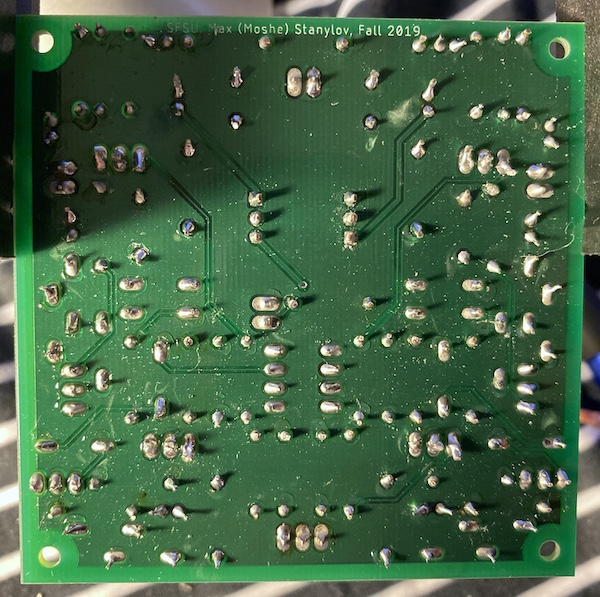

# HeadphoneAmp

In this project I have designed and implemented a Low Noise Headphone Amplifier. The purpose of this project was to gain a better understanding of the design process of printed circuit boards and to practice common engineering tasks such as drafting a schematic, generating a pcb layout from a schematic, generating a bill of materials and soldering components to a PCB.

## Design

The circuit is composed of three smaller circuits, a power supply and two mono
audio channels.
Dividing the entire schematic into three portions helped later with the board layout since I was able to easily separate the power supply from the signal path.

### Power Supply

The power supply receives 15V AC at the input terminal and outputs -15V DC and +15V DC at the output terminals. It achieves the rectification by using a combination of diodes, capacitors, resistors and voltage regulators.

### Audio Channels

Since this is a stereo amplifier, it is crucial to get the gain and signal to noise ratio of each individual mono channel to match. This is why the left and right audio channel schematics are exactly the same. There will still be some small differences since the tolerance of the components can’t be 0% but this difference is hardly noticeable.

The left and right audio channels both receive an audio signal and amplify it using a non inverting amplifier. The operational amplifier that is used in the circuit is a OP275, with two channels on the same IC chip.

## Layout

I’ve placed the power supply components in the upper corner of the board far from the signal path. By doing so I reduced the 60hz noise that can be caused by induction, since the wires carrying 15V AC are far from the wires that carry audio signal.
Another improvement to the layout was to set different trace thickness for power and signal traces.
The majority of the back panel was used as a ground plane. This helps to further reduce noise. For the connections from the PCB to external components I used terminal block plugs, it helped with keeping the design clean and flexible when it comes to connecting and disconnecting external components.

